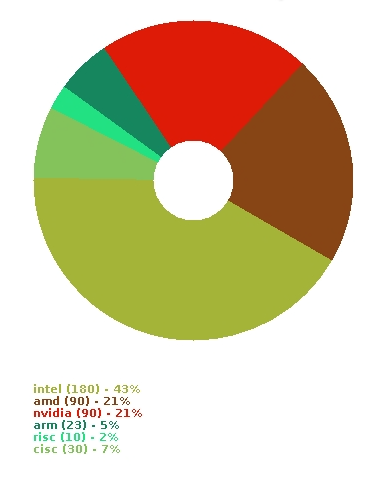
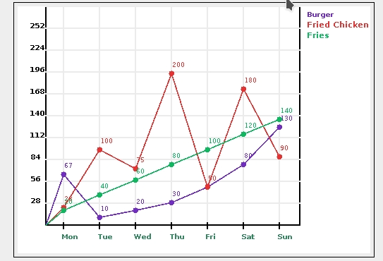

# jcharts
a simple graph-charts library for java swing GUI, provides pie graph and line graph

# Pie Graph - Sample Program

```java
import java.util.*;
import javax.swing.*;
import jcharts.*;

public class PieSample{
	public static void main(String[] args){
		int width = 400;
        int height = 600;	

    	// create your pie
        JpieCharts pie = new JpieCharts(
            new int[]{width,height},
            new String[]{"intel","amd","nvidia","arm","risc","cisc"}, // labels
            new int[]{180,90,90,23,10,30} // data
        );

        // a JPanel container
        JPanel p = new JPanel();
        p.setSize(width,height);

        // add the pie chart to the container JPanel
        p.add(pie);

        JFrame f = new JFrame();
        f.add(p);
        f.pack();
        f.setSize(width,height);
        f.setVisible(true);
        f.setDefaultCloseOperation(JFrame.DISPOSE_ON_CLOSE);

        // you can also add the chart directly to frame if you want
	}
}

```
## resulting output


------------------------------------------------------------------------------------------------------

# Line Graph - Sample Program

```java
import java.util.*;
import javax.swing.*;
import jcharts.*;

public class LineSample{
	public static void main(String[] args){

		int graphWidth = 500;
		int graphHeight = 350;

		int widthForYLabels = 40;
		int heightForXLabels = 40;

		int widthForItemLabel = 100;
        
		// create your line graph
        JtimeSeries p = new JtimeSeries(
            new int[]{graphWidth,graphHeight}, // size of chart
            new int[]{widthForYLabels, heightForXLabels, widthForItemLabel},
            new String[]{"Mon","Tue","Wed","Thu","Fri","Sat","Sun"}, // X Labels Array
            new String[]{"Burger","Fried Chicken","Fries"},  // Y Labels Array
            new int[][] // Data is a 2d array
            { 			
                {67,10,20,30,50,80,130},
                {23,100,75,200,50,180,90},
                {20,40,60,80,100,120,140}
                /*NOTE
            		the length of the inner arrays should match the lenght of the "X Label Array"
            		the length of the outer array should match the length of the "Y Label Array"
            	*/
            }
        );

        // adding panel to another panel
        JPanel container = new JPanel();
        container.setSize(750,480);
        container.add(p);

        // adding the parent panel to the main frame
        JFrame f = new JFrame();
        f.add(container);
        f.pack();
        f.setSize(750,480);
        f.setVisible(true);
        f.setDefaultCloseOperation(JFrame.DISPOSE_ON_CLOSE);
	}
}
```
## reuslting output

